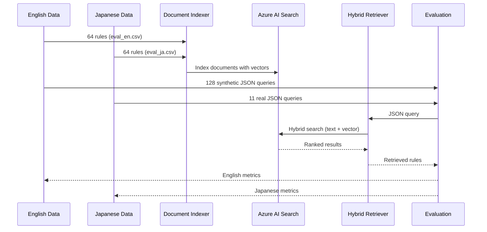

# Azure AI Search POC

Hybrid search (text + vector) for expense rule retrieval.

## Data Flow



### Dataset Differences

**English (en_synth)**:
- 64 unique expense rules
- 128 synthetic test queries (2 per rule)
- Index: `aiq-expense-rules-en`

**Japanese (ja)**:
- 64 unique expense rules  
- 11 real test queries
- Index: `aiq-expense-rules-ja`

## Setup

1. Copy `env.example` to `.env` and fill in Azure credentials
2. `poetry install`

## Usage

```bash
# Index documents
poetry run python src/index_documents.py --use-hybrid --dataset en
poetry run python src/index_documents.py --use-hybrid --dataset ja

# Run evaluation
poetry run python eval_azure_search.py --dataset en_synth
poetry run python eval_azure_search.py --dataset ja
```

## Results

- **English**: 34.4% recall@3, 28.0% nDCG, 15.5% confusion
- **Japanese**: 100.0% recall@3, 95.5% nDCG, 24.2% confusion

Results saved to `azure_search_results_*.md`.